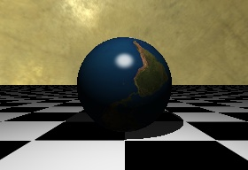

# simple-raytracer

Simple Raytracer written in pure Python. It's main purpose is to help
understand how raytracing works. If you are looking for an efficient raytracer
you should probably use something like C++. The equations used are from the
Image Synthesis class at Texas A&M University taught by professor Ergun Akleman 

It creates a raytraced image of a scene with simple objects like spheres and
planes. It's using a resolution of 200x200px by default and random jitter
anti-aliasing.

## Usage

- Install all the dependencies required
- Run `python -u main.py` (-u is for displaying print messages)
- The output image will be stored in the project folder

## Testing

To run the tests use unittest in this way `python -m unittest -v tests`.
This will run every test in the "_tests_" module, if you add new tests make sure to
import them into the "_\_\_init\_\_.py_" file of the "_tests_" folder.

## Dependencies

You will need to install
- Python (currently working with python 2.7, it should work with 3 too)

And Python modules
- numpy
- pillow
- progress

You can install python modules, for example, by running:
`python -m pip install numpy pillow progress`

Developed by Jesús Henríquez
